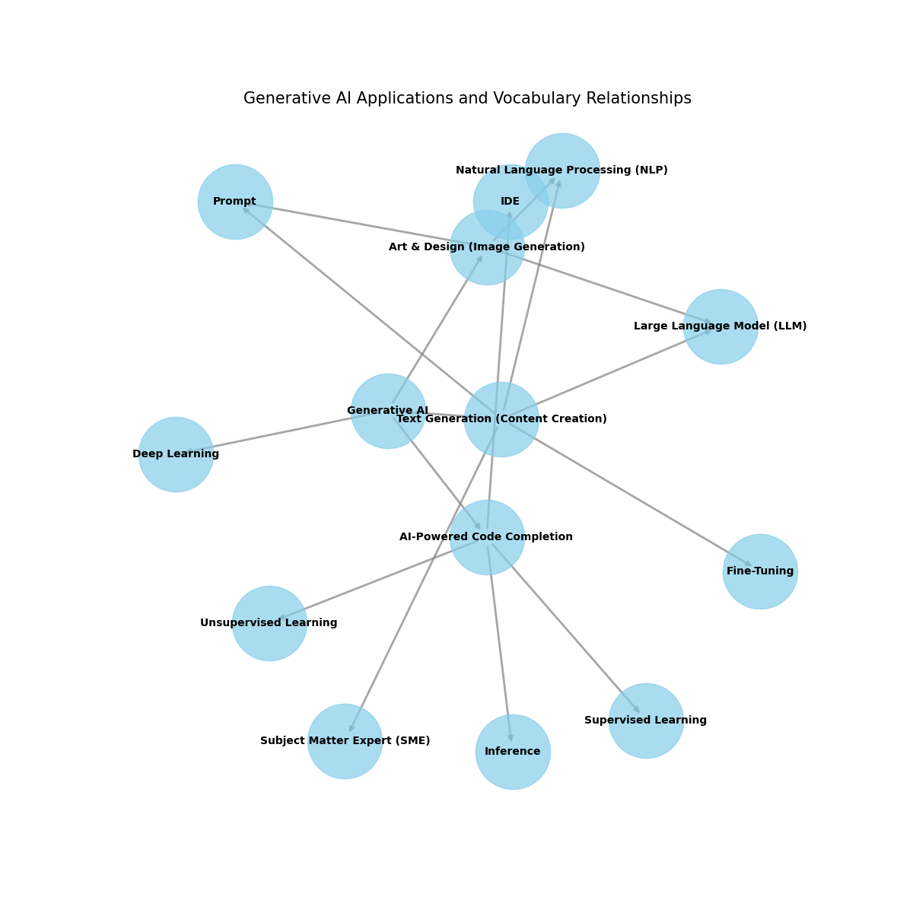

# Generative AI Applications Use Cases
## Use Case 1: Generative AI for Text Generation (Content Creation)

### Business Value:
One of the main strengths of GenAI that is really helpful in business nowadays is text generation. Tools like ChatGPT are able to generate content for blog posts, marketing strategies, product descriptions, and can handle emails for partners. This feature helps business owners stay online and does not require manual work and can be flexible to newest changes.

### Technical Challenges:
Even though GenAI has powerful opportunities, it contains challenges such as coherence and context, emotional depth and nuance. In short-term or in small tasks, GenAI can generate strong responses, but in long-term it fails in keeping the logic. The logic flow is reduced across long paragraphs or articles. Furthermore, GenAI cannot convey emotion through the text but it can be needed to hold the connection between customer and company so it can look like realistic, and at the end customers can feel what is happening in the company.

### Weak Points:
The biggest limitation of AI is its potential bias and lack of creativity. AI will answer to individuals based on the existing data. However, it may contain some errors or bias so it will lead to inaccurate answers. Also, AI can generate responses based on patterns, but for companies in the marketing field who need originality or creativity it will be a main barrier. It can also produce invalid data if training data is not updated regularly. 

### Existing Implementations:
* **GPT-3 by OpenAI**: [OpenAI GPT-5](https://beta.openai.com/)
    * **Description**: One of the LLM that can produce human-written texts and even for now is used for customer support services, online chatbots and in other applications. 

* **Copy.ai**: [Copy.ai](https://www.copy.ai/)
    * **Description**: Tool that even suprised Lenovo used for content creator, social media posts or give text quickly and efficiently. 

---

## Use Case 2: Generative AI for Art and Design (Image Generation)

### Business Value:
Nowadays, for digital marketing the ability to generate visual product is highly valuable. Modern tools like **MidJourney** or **DALL·E 2** crashing the world by giving high-quality images from even simple prompts and at the same time saving the vast amount of time and money spend by business. It enhances customer experience by givign personalized images and improving efficiency. 

### Technical Challenges:
Even if it can be efficient in generating simple ones, it can struggle when it comes to complex tasks. It can lack human creativity and not produce custome target output. In nuances, it may fail to give fully symmetry or detailed correctly wirtten texts. 
### Weak Points:
AI uses existing designs and images to produce new one so it may lack in originality and privcay, so for artists this is main struggle. For generating new one, it requires more data that were no seen before. In comparison for human artists, their products may require financial credits for using their work as foundation. 

### Existing Implementations:
* **MidJourney**: [MidJourney](https://www.midjourney.com/)
    * **Description**: One of the AI tools that as input accepts simple text and from them makes the images, mainlu used in fantasy landscapes, character designs, and conceptual art.

* **DALL·E 2 by OpenAI**: [DALL·E 2](https://openai.com/dall-e-2)
    * **Description**: One of the AI tools that can generate realistic and creative images from complex description and best for advertising and branding. 

---

## Use Case 3: AI-Powered Code Completion (Copilots)

### Business Value:
AI-powered code completion greatly improves developer productivity by automating routine coding tasks, suggesting entire functions, and cutting down the time spent searching for syntax or APIs. This faster development process shortens software release cycles. The technology provides significant cost savings by lowering manual work and reducing common, repetitive coding mistakes.

### Technical Challenges:
A main technical challenge is making sure the generated code is secure, efficient, and free from vulnerabilities. Keeping context awareness over long code files and complex project structures is tough. The model can sometimes suggest irrelevant or outdated code patterns. Integrating these tools smoothly into different development environments and workflows without disrupting the developer's process is also a major engineering challenge.

### Weak Points:
A key issue is the model's tendency to create code that looks correct but has hidden logical errors or fake APIs. This can create a misleading sense of security. It may also accidentally introduce security problems or bugs that are difficult to find. Relying too much on the tool might cause developers to lose their grasp of basic programming concepts. Legal and licensing issues about the source of the training data and the ownership of the AI-generated code are still mostly unresolved, which poses a risk for business use.

### Existing Implementations:
* **GitHub Copilot**: [GitHub Copilot](https://github.com/features/copilot)
    * **Description**: An AI pair programmer that suggests entire lines and blocks of code in real-time directly within various code editors.

* **Amazon CodeWhisperer**: [Amazon CodeWhisperer](https://aws.amazon.com/codewhisperer/)
    * **Description**: An AI tool that generates code suggestions from natural language comments and code, with integrated security scanning and optimization for AWS services.

# Generative AI Vocabulary
My glossary: 

*   **Generative AI:** Instead of just analyzing, it creates new content, such as text, images, videos, or even music, and it is a type of AI. 
*   **Large Language Model (LLM):** A very large deep learning model that was pre-trained on a vast amount of data and can predict the next word and generate human-written text. The most popular example is ChatGPT (5.0). 
*   **Prompt:** The instruction given to an LLM to perform specific tasks, and the quality of the output is directly dependent on the quality of the prompt. 
*   **Fine-Tuning:** Taking pre-trained data and training it further on specific cases so that it can be an expert in a particular field. 
*   **Subject Matter Expert (SME):** An individual who has expertise in a specific field; in the case of GenAI, this person can guide in fine-tuning and validating outputs.
*   **IDE (Integrated Development Environment):** A software application that helps programmers write code or edit in real-time, and it can be integrated with AI like VS Code.
*   **Inference:** It is called a runtime model, where the input is taken from unseen new data, so that it is used for predicting on pre-trained data and validating the model. 
* **Supervised Learning:** It is a type of ML that is trained on labeled data, which means each data point has its correct output.
* **Unsupervised Learning:** It is a type of ML that is trained on unlabeled data, which means output can be found as the results of patterns and relationships.
* **Natural Language Processing (NLP):** It is used for connecting humans and computers, enabling computers to understand, generate, and interpret human language.
* **Deep Learning:** It is considered a subset of ML that uses neural networks to model complex patterns in large datasets. Nowadays, it is a key way to train generative models. 

# Generative AI Applications and Vocabulary Graph

Below is a Python code block that generates a graph showing the relationships between different **Generative AI applications** and **vocabulary terms**. To run this code, you will need a Python environment with the libraries **NetworkX** and **Matplotlib** installed.

### Python Code to Generate the Graph:

```python
    import matplotlib.pyplot as plt
    import networkx as nx

    G = nx.DiGraph()

    G.add_node("Generative AI")
    G.add_node("Text Generation (Content Creation)")
    G.add_node("Art & Design (Image Generation)")
    G.add_node("AI-Powered Code Completion")

    vocabulary_terms = [
        "Generative AI", "Large Language Model (LLM)", "Prompt", "Fine-Tuning", 
        "Subject Matter Expert (SME)", "IDE", "Inference", "Supervised Learning", 
        "Unsupervised Learning", "Natural Language Processing (NLP)", "Deep Learning"
    ]

    for term in vocabulary_terms:
        G.add_node(term)

    G.add_edges_from([
        ("Generative AI", "Text Generation (Content Creation)"),
        ("Generative AI", "Art & Design (Image Generation)"),
        ("Generative AI", "AI-Powered Code Completion"),
        ("Text Generation (Content Creation)", "Large Language Model (LLM)"),
        ("Text Generation (Content Creation)", "Prompt"),
        ("Text Generation (Content Creation)", "Fine-Tuning"),
        ("Art & Design (Image Generation)", "Large Language Model (LLM)"),
        ("Art & Design (Image Generation)", "Prompt"),
        ("AI-Powered Code Completion", "IDE"),
        ("AI-Powered Code Completion", "Inference"),
        ("AI-Powered Code Completion", "Supervised Learning"),
        ("AI-Powered Code Completion", "Unsupervised Learning"),
        ("Text Generation (Content Creation)", "Subject Matter Expert (SME)"),
        ("Text Generation (Content Creation)", "Natural Language Processing (NLP)"),
        ("Art & Design (Image Generation)", "Natural Language Processing (NLP)"),
        ("Generative AI", "Deep Learning"),
    ])

    pos = nx.spring_layout(G, seed=42)

    plt.figure(figsize=(12, 12))
    nx.draw_networkx_nodes(G, pos, node_size=5000, node_color='skyblue', alpha=0.7)
    nx.draw_networkx_labels(G, pos, font_size=10, font_weight='bold')
    nx.draw_networkx_edges(G, pos, edgelist=G.edges(), edge_color='gray', width=2, alpha=0.7)

    plt.title("Generative AI Applications and Vocabulary Relationships", fontsize=15)
    plt.axis('off')  
    plt.show()
```
Output: 

